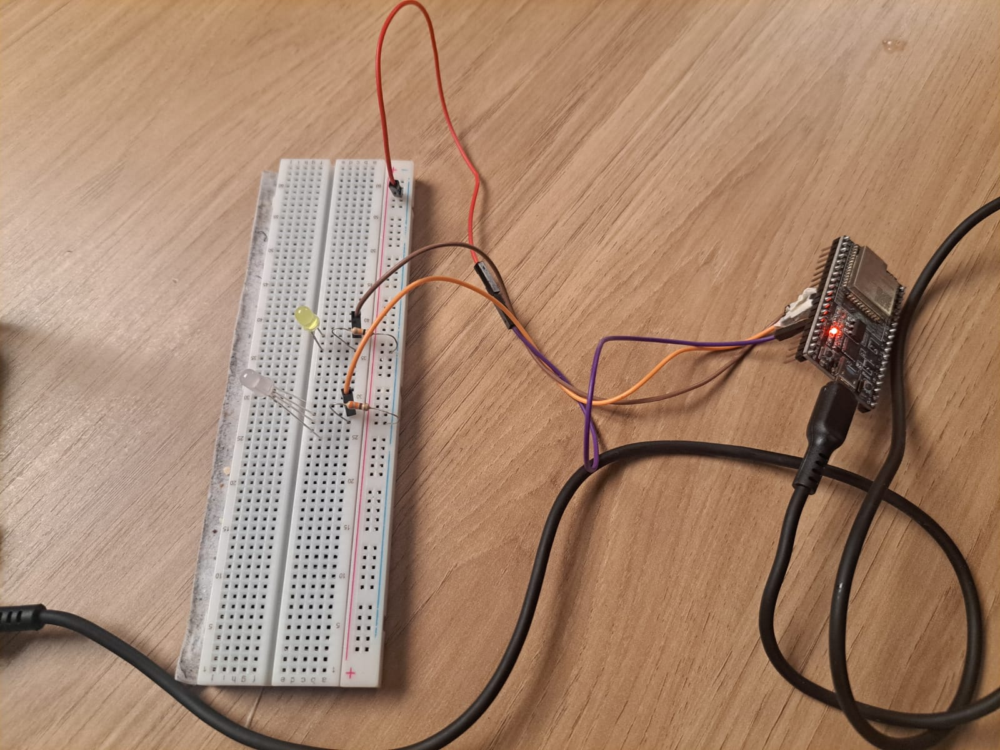
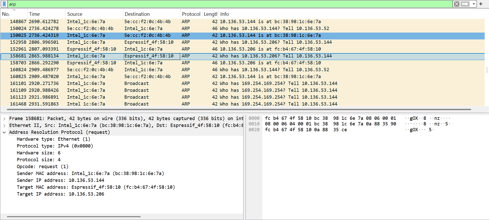
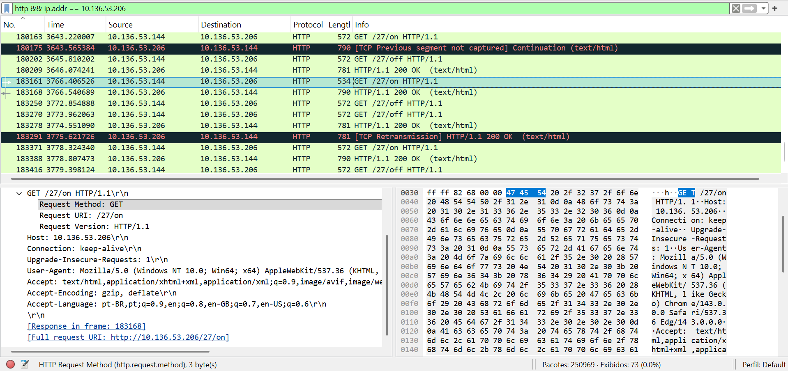

# Segurança-em-IoT

## Introdução

A segurança em IoT é fundamental porque esses dispositivos estão cada vez mais presentes no nosso cotidiano e lidam com informações sensíveis. Quando não são bem protegidos, tornam-se alvos fáceis para pessoas mal-intencionadas, que podem explorar falhas para obter acesso indevido ou manipular o funcionamento do sistema. Nesse cenário, o pentest tem um papel essencial, pois permite identificar vulnerabilidades por meio de testes que simulam ataques reais, garantindo que falhas sejam corrigidas antes de serem exploradas.

Como parte desse estudo, preciso realizar uma análise estática do código do dispositivo IoT para identificar possíveis pontos fracos e entender como eles poderiam ser explorados. O objetivo é encontrar pelo menos dois tipos de ataques diferentes que possam afetar o sistema, como interceptação de dados, acesso não autorizado ao servidor web ou manipulação das requisições enviadas ao ESP32. Essa etapa é importante para desenvolver uma visão crítica sobre segurança e aprender a criar soluções mais robustas e confiáveis.

O código a ser analisado está abaixo:

```
/*********
  Rui Santos
  Complete project details at https://randomnerdtutorials.com  
*********/

// Load Wi-Fi library
#include <WiFi.h>

// Replace with your network credentials
const char* ssid = "REPLACE_WITH_YOUR_SSID";
const char* password = "REPLACE_WITH_YOUR_PASSWORD";

// Set web server port number to 80
WiFiServer server(80);

// Variable to store the HTTP request
String header;

// Auxiliar variables to store the current output state
String output26State = "off";
String output27State = "off";

// Assign output variables to GPIO pins
const int output26 = 26;
const int output27 = 27;

// Current time
unsigned long currentTime = millis();
// Previous time
unsigned long previousTime = 0; 
// Define timeout time in milliseconds (example: 2000ms = 2s)
const long timeoutTime = 2000;

void setup() {
  Serial.begin(115200);
  // Initialize the output variables as outputs
  pinMode(output26, OUTPUT);
  pinMode(output27, OUTPUT);
  // Set outputs to LOW
  digitalWrite(output26, LOW);
  digitalWrite(output27, LOW);

  // Connect to Wi-Fi network with SSID and password
  Serial.print("Connecting to ");
  Serial.println(ssid);
  WiFi.begin(ssid, password);
  while (WiFi.status() != WL_CONNECTED) {
    delay(500);
    Serial.print(".");
  }
  // Print local IP address and start web server
  Serial.println("");
  Serial.println("WiFi connected.");
  Serial.println("IP address: ");
  Serial.println(WiFi.localIP());
  server.begin();
}

void loop(){
  WiFiClient client = server.available();   // Listen for incoming clients

  if (client) {                             // If a new client connects,
    currentTime = millis();
    previousTime = currentTime;
    Serial.println("New Client.");          // print a message out in the serial port
    String currentLine = "";                // make a String to hold incoming data from the client
    while (client.connected() && currentTime - previousTime <= timeoutTime) {  // loop while the client's connected
      currentTime = millis();
      if (client.available()) {             // if there's bytes to read from the client,
        char c = client.read();             // read a byte, then
        Serial.write(c);                    // print it out the serial monitor
        header += c;
        if (c == '\n') {                    // if the byte is a newline character
          // if the current line is blank, you got two newline characters in a row.
          // that's the end of the client HTTP request, so send a response:
          if (currentLine.length() == 0) {
            // HTTP headers always start with a response code (e.g. HTTP/1.1 200 OK)
            // and a content-type so the client knows what's coming, then a blank line:
            client.println("HTTP/1.1 200 OK");
            client.println("Content-type:text/html");
            client.println("Connection: close");
            client.println();
            
            // turns the GPIOs on and off
            if (header.indexOf("GET /26/on") >= 0) {
              Serial.println("GPIO 26 on");
              output26State = "on";
              digitalWrite(output26, HIGH);
            } else if (header.indexOf("GET /26/off") >= 0) {
              Serial.println("GPIO 26 off");
              output26State = "off";
              digitalWrite(output26, LOW);
            } else if (header.indexOf("GET /27/on") >= 0) {
              Serial.println("GPIO 27 on");
              output27State = "on";
              digitalWrite(output27, HIGH);
            } else if (header.indexOf("GET /27/off") >= 0) {
              Serial.println("GPIO 27 off");
              output27State = "off";
              digitalWrite(output27, LOW);
            }
            
            // Display the HTML web page
            client.println("<!DOCTYPE html><html>");
            client.println("<head><meta name=\"viewport\" content=\"width=device-width, initial-scale=1\">");
            client.println("<link rel=\"icon\" href=\"data:,\">");
            // CSS to style the on/off buttons 
            // Feel free to change the background-color and font-size attributes to fit your preferences
            client.println("<style>html { font-family: Helvetica; display: inline-block; margin: 0px auto; text-align: center;}");
            client.println(".button { background-color: #4CAF50; border: none; color: white; padding: 16px 40px;");
            client.println("text-decoration: none; font-size: 30px; margin: 2px; cursor: pointer;}");
            client.println(".button2 {background-color: #555555;}</style></head>");
            
            // Web Page Heading
            client.println("<body><h1>ESP32 Web Server</h1>");
            
            // Display current state, and ON/OFF buttons for GPIO 26  
            client.println("<p>GPIO 26 - State " + output26State + "</p>");
            // If the output26State is off, it displays the ON button       
            if (output26State=="off") {
              client.println("<p><a href=\"/26/on\"><button class=\"button\">ON</button></a></p>");
            } else {
              client.println("<p><a href=\"/26/off\"><button class=\"button button2\">OFF</button></a></p>");
            } 
               
            // Display current state, and ON/OFF buttons for GPIO 27  
            client.println("<p>GPIO 27 - State " + output27State + "</p>");
            // If the output27State is off, it displays the ON button       
            if (output27State=="off") {
              client.println("<p><a href=\"/27/on\"><button class=\"button\">ON</button></a></p>");
            } else {
              client.println("<p><a href=\"/27/off\"><button class=\"button button2\">OFF</button></a></p>");
            }
            client.println("</body></html>");
            
            // The HTTP response ends with another blank line
            client.println();
            // Break out of the while loop
            break;
          } else { // if you got a newline, then clear currentLine
            currentLine = "";
          }
        } else if (c != '\r') {  // if you got anything else but a carriage return character,
          currentLine += c;      // add it to the end of the currentLine
        }
      }
    }
    // Clear the header variable
    header = "";
    // Close the connection
    client.stop();
    Serial.println("Client disconnected.");
    Serial.println("");
  }
}
```

## Análise Estática do Código – Vulnerabilidades e Possíveis Ataques

Ao analisar o código do ESP32 que implementa um servidor web simples para controlar GPIOs, é possível identificar vários pontos fracos importantes. A seguir, listo as vulnerabilidades e, em seguida, descrevo dois tipos de ataques possíveis.

### Vulnerabilidades:
- Credenciais de Wi-Fi Hardcoded: as credenciais estão diretamente dentro do código, então sua rede fica exposta.

- Servidor HTTP sem criptografia: qualquer pessoa na mesma rede Wi-Fi pode capturar suas requisições, usando ferramentas simples como o Wireshark por exemplo.

- Falta de autenticação: o dispositivo aceita qualquer requisição GET, assim qualquer pessoa na rede pode ligar/desligar os GPIOs.

- Falta de limite na requisição: a variável header acumula todo o conteúdo da requisição, sem limite de tamanho, o que pode travar o ESP32.

### Ataques Possíveis:

#### 1 - Acesso não autorizado

**Passo-a-Passo:**

1. Descoberta do dispositivo: O atacante realiza uma varredura da rede local para identificar endereços IP ativos e portas abertas.

2. Identificação do serviço: Ao encontrar o IP que responde na porta 80, o atacante abre o endereço no navegador ou faz uma requisição HTTP simples para confirmar que é o servidor do ESP32.

3. Interação com endpoints expostos: Como não há autenticação, o atacante acessa os caminhos GET /26/on, GET /26/off, GET /27/on ou GET /27/off. O servidor processa essas requisições e aciona os GPIOs.

**Probabilidade:** Alta, pois o dispositivo responde à porta 80 sem exigir autenticação e um invasor que obtenha acesso à rede  tem meios simples de encontrar e acessar o servidor.

**Impacto estimado:** Baixo, já que os pinos controlam apenas LEDs, mas caso esses pinos fossem usados para controlar dispositivos críticos, o impacto seria alto, porque qualquer um na rede teria total controle sobre eles.

**Risco resultante:** Baixo, porque o sistema só controla LEDs. Entretanto, em um ambiente real, a ausência de autenticação poderia representar risco significativo para equipamentos sensíveis.

#### 2 - Sniffing / Interceptação

**Passo-a-Passo:**

1. Posicionamento na mesma rede: O atacante precisa estar na mesma rede local (ou posicionar-se entre o cliente e o ESP32).

2. Captura de tráfego: O atacante monitora o tráfego HTTP, usando ferramentas como o Wireshark, em texto plano e identifica requisições relevantes para o ESP32 (por exemplo, GET /26/on).

3. Análise das requisições: Com as mensagens em texto, o atacante entende o formato das requisições e quando elas são enviadas (manual ou automatizadas).

4. Repetição de requisições (replay): O atacante reaplica as mesmas requisições capturadas para provocar as mesmas ações no dispositivo (por exemplo, ligar/desligar repetidamente).

**Probabilidade:** Média a alta, pois sniffing é relativamente trivial para alguém com acesso à rede, então vai depender da facilidade de acesso ao rede. 

**Impacto estimado:** Médio, porque permite-se reproduzir comandos válidos e observar quando usuários controlam o dispositivo. Pode levar a controle não autorizado e descoberta de rotina de uso.

**Risco resultante:** Médio a alto, pois a facilidade de capturar e reproduzir tráfego HTTP em texto torna esse cenário perigoso em redes insuficientemente protegidas. 

#### 3 - DoS (Negação de Serviço) via requisições excessivas

**Passo-a-Passo:**

1. Identificação do alvo: O atacante localiza o IP do ESP32 e identifica que o servidor aceita conexões e concatena o conteúdo das requisições na variável header.

2. Criação de requisições grandes ou contínuas: O atacante envia uma requisição HTTP muito grande ou mantém conexões abertas e enviando bytes, fazendo com que header += c; cresça sem controle.

3. Exaustão de recursos: A memória dinâmica do ESP32 e/ou o tempo de CPU é consumido ao processar as entradas muito grandes; o dispositivo pode ficar lento, travar ou reiniciar.

4. Saturação de conexões: Alternativamente, o atacante pode abrir muitas conexões simultâneas e não fechá-las, esgotando a capacidade de atender novos clientes.

5. Interrupção do serviço: Como resultado, o servidor web deixa de responder a clientes legítimos e os controles ficam indisponíveis.

**Probabilidade:** Média, pois caso a rede seja bem monitorada alguém pode detectar essa tentantiva de DoS e bloquear o ataque reduzindo a probabilidade. 

**Impacto estimado:** Médio a alto, porque a indisponibilidade pode variar de perda temporária de controle (baixo impacto) até redução de funcionalidade crítica (alto impacto). Além disso, reboots constantes podem danificar componentes.

**Risco resultante:** Médio, pois o ataque é relativamente fácil de executar e pode deixar o sistema indisponível, embora não cause danos permanentes de forma imediata.

Em suma, é importante notar que a probabilidade depende fortemente do ambiente, redes domésticas sem segmentação e com senhas fracas aumentam muito a chance de exploração. Enquanto, o impacto depende do que os GPIOs controlam, dispositivos eletrônicos simples como LEDs ou dispositivos mais sensíveis, como motores.

| **Ataque**         | **Probabilidade** | **Impacto**  | **Risco**    |
| ---------------------------- | ----------------- | ------------ | ------------ |
| **Sniffing / Interceptação** | Média a alta      | Médio        | Médio a alto |
| **DoS – Negação de Serviço** | Média             | Médio a alto | Médio        |
| **Acesso não autorizado**    | Alta              | Baixo        | Baixo        |


### Simulando ataque de Acesso não autorizado

O vídeo abaixo demonstra a execução do Ataque 1, no qual o objetivo é realizar uma análise dinâmica e identificar o endereço IP do ESP32 na rede para, em seguida, explorar endpoints HTTP expostos sem autenticação.

[Vídeo]()

#### Etapa 1 — Captura do tráfego e descoberta do IP do ESP32

Com o circuito montado em protoboard e o código corretamente carregado no ESP32, iniciei a análise utilizando o Wireshark.
Primeiro, apliquei o filtro:
```
arp
```
Esse filtro permite visualizar apenas pacotes ARP, que são especialmente úteis para identificar dispositivos pela rede. Entre as requisições ARP capturadas, procurei por pacotes contendo o fabricante Espressif, que corresponde ao ESP32.
Ao localizar o pacote desejado, foi possível identificar o seguinte campo:
```
**Target IP Address: 10.136.53.206**
```

<div align="center">
  <sub>FIGURA 1 – Circuito montado na protoboard</sub><br>
  <br>
  <sup>Fonte: Material produzido pela autora, 2025.</sup>
</div>

<div align="center">
  <sub>FIGURA 2 – Arp aplicado como filtro no Wireshark</sub><br>
  <br>
  <sup>Fonte: Material produzido pela autora, 2025.</sup>
</div>

#### Etapa 2 — Filtrando o tráfego HTTP do ESP32

Com o IP descoberto, apliquei um segundo filtro no Wireshark para monitorar apenas as conexões HTTP realizadas pelo dispositivo:
```
http && ip.addr == 10.136.53.206
```
Dessa forma, todas as requisições HTTP originadas ou destinadas ao ESP32 passaram a ser exibidas.
Entre elas, identifiquei uma URL acessível via GET, que permitia controlar os LEDs do circuito.

<div align="center">
  <sub>FIGURA 2 – Filtro IP aplicado como filtro no Wireshark</sub><br>
  <br>
  <sup>Fonte: Material produzido pela autora, 2025.</sup>
</div>

#### Etapa 3 — Execução do ataque

Após copiar a URL exposta, pude acessá-la diretamente pelo navegador. A requisição foi processada sem qualquer autenticação, o que permitiu:

- Ligar o LED verde remotamente

- Acessar o "painel" exposto pelo ESP32

- Manipular livremente o sistema, demonstrando controle total sobre o dispositivo